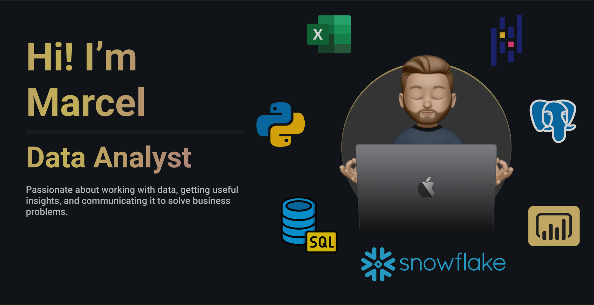
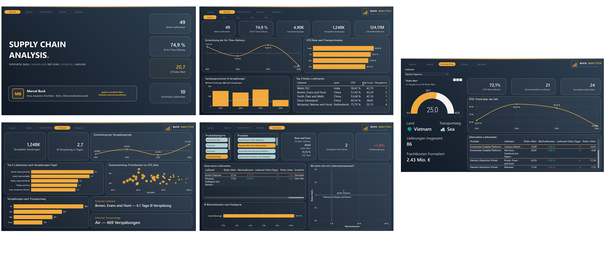
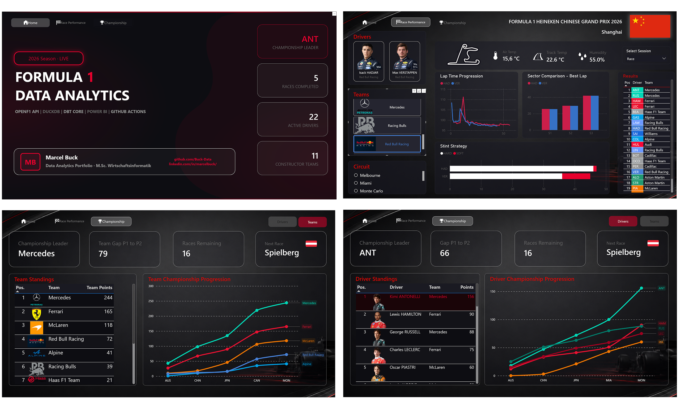

  

<h1 align="center">Marcel Buck</h1>

  <strong>Data Analyst · M.Sc. Wirtschaftsinformatik</strong> 
  Python &nbsp;•&nbsp; SQL &nbsp;•&nbsp; Power BI &nbsp;•&nbsp; dbt &nbsp;•&nbsp; DuckDB &nbsp;•&nbsp; Snowflake

  
  
  

---

## Über mich

M.Sc. Wirtschaftsinformatik mit klarem Fokus auf den Datenbereich. Ich baue End-to-End-Datenprojekte von der Pipeline bis zum Dashboard und will die gesamte Werkzeugkette solide aufbauen, bevor ich mich spezialisiere. Wohin die Spezialisierung geht, ob Power BI, Data Engineering, Consulting oder Cloud, will ich aus der Praxis heraus entscheiden.
Was mich auszeichnet: Ich arbeite mich schnell in neue Tools ein und gehe Datenprojekte mit echtem Interesse an der Sache an. Ich bleibe gerne am Zahn der Zeit und probiere neue Technologien aus, um Prozesse effizienter zu gestalten. Dabei gehe ich bedacht und verantwortungsvoll vor und prüfe die Ergebnisse immer kritisch, statt sie blind zu übernehmen.
Aus meinem Praktikum im Requirements Engineering und meiner Masterarbeit, einer Anforderungsanalyse für Datenplattformen im Metallschrott-Recycling, bringe ich etwas mit, das viele technische Profile nicht haben: Ich höre zuerst zu und verstehe die Anforderungen der Stakeholder, bevor ich baue. Das Ergebnis sind Lösungen, die tatsächlich genutzt werden statt an den Interessen der Nutzer vorbeizulaufen.

Was ich bisher gebaut habe:

- **Supply-Chain Resilience** — End-to-End-Pipeline, die verstreute Lieferkettendaten automatisiert in ein Power-BI-Dashboard bringt und Engpasslieferanten sowie kritische Routen sichtbar macht.
- **F1 Analytics** — End-To-End Projekt, das nach jedem Rennwochenende Daten aus 10 OpenF1-API-Endpunkten zieht und Strategie-, Wetter- und WM-Einblicke ohne manuellen Aufwand aktualisiert.
- **Kundenabwanderungs-Vorhersage** — Klassifikationsmodell, das individuelles Abwanderungsrisiko vorhersagt (ROC-AUC 0.87) und die wichtigsten Treiber offenlegt.
- **AIoT im Wassermanagement (TDWI 2025)** — Konzept für datengestützte Bewässerungsplanung, präsentiert im Student Corner der TDWI-Konferenz.
- **Funnel-Analyse (in Arbeit)** — Auswertung des Nutzer-Funnels, um Absprungpunkte und Conversion-Hebel im E-Commerce sichtbar zu machen.

---

## Tech Stack

### Analyse & Machine Learning

### Datenbanken & Warehousing

### BI & Visualisierung

### Data Engineering & Tools

---

## Projekte

### [Supply-Chain Resilience – End-to-End Projekt](https://github.com/Buck-Data/Supply-Chain-Projekt)

  

| | |
|---|---|
| **Problem** | Lieferkettendaten lagen verteilt und unstrukturiert vor — kein zentrales Bild der Supply-Chain-Lage |
| **Lösung** | Vollautomatisierte End-to-End-Pipeline: Rohdaten → DuckDB Warehouse → dbt → Power BI Dashboard |
| **Impact** | Dashboard aktualisiert sich automatisch — Entscheidungsträger sehen KPIs in Echtzeit |

**Methodik**

- Inkrementelles Laden via State-Tracking — nur neue Datensätze werden verarbeitet
- Parallele Datenabfragen mit 4 Workern (~4x schneller als sequentiell)
- Zweischichtiges dbt-Modell: Staging (Bereinigung) → Sternschema (Dims + Facts)
- 69 automatisierte Datentests (not_null, unique, referentielle Integrität, Geschäftslogik)
- Wöchentliche CI/CD-Pipeline via GitHub Actions

**Wichtige Erkenntnisse**

- Lieferverzögerungen lassen sich auf Engpasslieferanten und kritische Routen zurückführen
- Lagerbestände und Vorlaufzeiten korrelieren messbar mit Saisonalität
- KPI-Tracking pro Lieferant ermöglicht datenbasierte Lieferantensteuerung

`Python` `DuckDB` `dbt Core` `Power BI` `GitHub Actions`

---

### [F1 Analytics – End-to-End Datenpipeline](https://github.com/Buck-Data/F1-End-to-End-Project)

  

| | |
|---|---|
| **Problem** | Formel-1-Renndaten manuell abrufen und auswerten — ineffizient und fehleranfällig |
| **Lösung** | Vollautomatisierte Pipeline: 10 OpenF1-API-Endpunkte → DuckDB Warehouse → dbt → Power BI |
| **Impact** | Dashboard aktualisiert sich automatisch nach jedem Rennwochenende — null manueller Aufwand |

**Methodik**

- Inkrementelles Laden via State-Tracking — nur neue Sessions werden abgerufen
- Parallele API-Abfragen mit 4 Workern (~4x schneller als sequentiell)
- Zweischichtiges dbt-Modell: Staging (Bereinigung) → Sternschema (Dims + Facts)
- 69 automatisierte Datentests (not_null, unique, referentielle Integrität, Geschäftslogik)
- Wöchentliche CI/CD-Pipeline via GitHub Actions (jeden Montag 06:00 UTC)

**Wichtige Erkenntnisse**

- Reifenstrategie und Stint-Längen haben messbaren Einfluss auf Rundenzeiten
- Wetterbedingungen (Temperatur, Luftfeuchtigkeit) korrelieren mit Sektorzeiten
- WM-Standings lassen sich pro Rennen verfolgen und visuell vergleichen

`Python` `DuckDB` `dbt Core` `Power BI` `GitHub Actions`

---

### Kundenabwanderungs-Vorhersage

| | |
|---|---|
| **Problem** | Unternehmen verlieren Kunden, ohne Warnsignale frühzeitig zu erkennen |
| **Lösung** | Klassifikationsmodell in Python zur Vorhersage individuellen Abwanderungsrisikos |
| **Ergebnis** | ROC-AUC: **0.87** |

**Wichtige Erkenntnisse**

- Nutzer mit geringem Engagement kündigen deutlich häufiger
- Preisstufe korreliert stark mit Kündigungen

`Python` `Pandas` `Scikit-Learn` `PostgreSQL`

---

### TDWI 2025 - Student Corner Projekt - AIoT im Wassermanagement

| | |
|---|---|
| **Problem** | Unternehmen verlieren Kunden, ohne Warnsignale frühzeitig zu erkennen |
| **Lösung** | Klassifikationsmodell in Python zur Vorhersage individuellen Abwanderungsrisikos |
| **Ergebnis** | ROC-AUC: **0.87** |

**Wichtige Erkenntnisse**

- Nutzer mit geringem Engagement kündigen deutlich häufiger
- Preisstufe korreliert stark mit Kündigungen

`Python` `Pandas` `Scikit-Learn` `PostgreSQL`

---

### Funnel Analyse (In Bearbeitung)

| | |
|---|---|
| **Problem** | Unternehmen verlieren Kunden, ohne Warnsignale frühzeitig zu erkennen |
| **Lösung** | Klassifikationsmodell in Python zur Vorhersage individuellen Abwanderungsrisikos |
| **Ergebnis** | ROC-AUC: **0.87** |

**Wichtige Erkenntnisse**

- Nutzer mit geringem Engagement kündigen deutlich häufiger
- Preisstufe korreliert stark mit Kündigungen

`Python` `Pandas` `Scikit-Learn` `PostgreSQL`

---

## Berufserfahrung

### Business Development & Process Automation – Werkstudent

- Lead-Recherche-Workflow automatisiert → messbare Zeitersparnis für das Vertriebsteam
- Marktanalysen und Wachstumsstrategien direkt mit Stakeholdern erarbeitet

### Requirements Engineering – Praktikant

- Geschäftsanforderungen strukturiert erhoben und dokumentiert
- Anforderungen in technische Spezifikationen übersetzt
- Als Schnittstelle zwischen Business und Entwicklungsteam agiert

---

## Derzeit am Lernen

`Advanced SQL für Analytics` &nbsp;·&nbsp; `Data Engineering` &nbsp;·&nbsp; `Production ML Pipelines`

---

## Verfügbar für

**Data Analyst · Business Intelligence Analyst · Junior Data Scientist**

📍 Remote · Deutschland · EU

---

## 🤝 Kontakt

  
  &nbsp;
  

