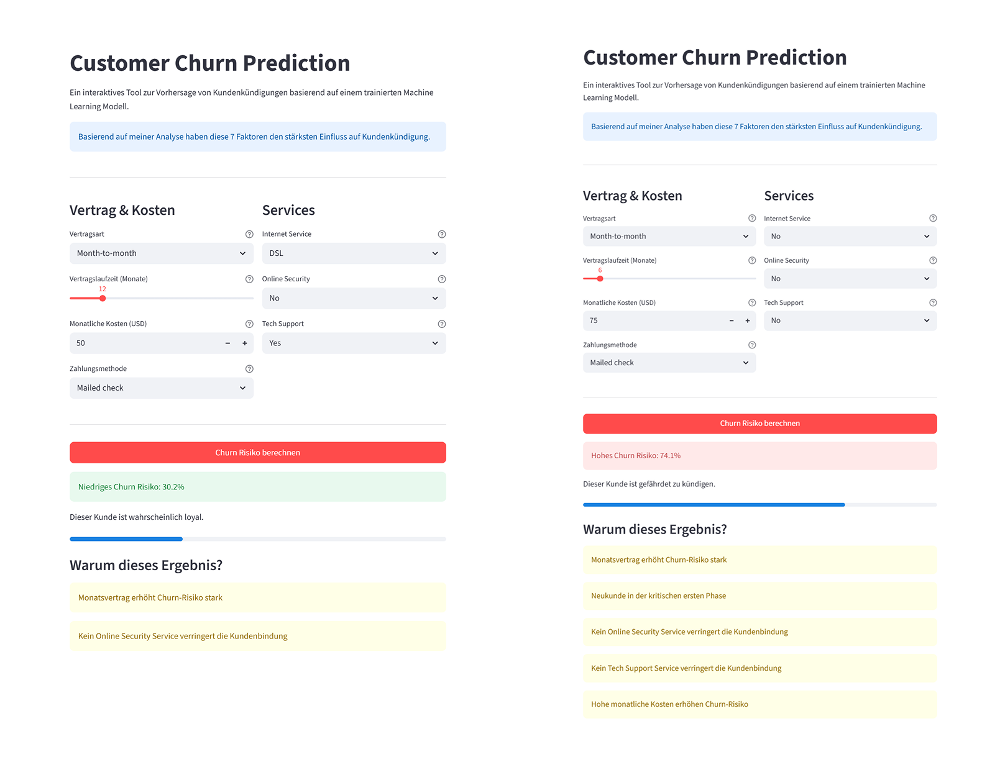

  

<h1 align="center">Marcel Buck</h1>

  <strong>Data Analyst · M.Sc. Wirtschaftsinformatik</strong> 
  Python &nbsp;•&nbsp; SQL &nbsp;•&nbsp; Power BI &nbsp;•&nbsp; dbt &nbsp;•&nbsp; DuckDB &nbsp;•&nbsp; Snowflake

  
  
  

---

## Über mich

M.Sc. Wirtschaftsinformatik mit klarem Fokus auf den Datenbereich. Ich baue End-to-End-Datenprojekte von der Pipeline bis zum Dashboard und will die gesamte Werkzeugkette solide aufbauen, bevor ich mich spezialisiere. Wohin die Spezialisierung geht, ob Power BI, Data Engineering, Consulting oder Cloud, will ich aus der Praxis heraus entscheiden.
Was mich auszeichnet: Ich arbeite mich schnell in neue Tools ein und gehe Datenprojekte mit echtem Interesse an der Sache an. Ich bleibe gerne am Zahn der Zeit und probiere neue Technologien aus, um Prozesse effizienter zu gestalten. Dabei gehe ich bedacht und verantwortungsvoll vor und prüfe die Ergebnisse immer kritisch, statt sie blind zu übernehmen.
Aus meinem Praktikum im Requirements Engineering und meiner Masterarbeit, einer Anforderungsanalyse für Datenplattformen im Metallschrott-Recycling, bringe ich etwas mit, das viele technische Profile nicht haben: Ich höre zuerst zu und verstehe die Anforderungen der Stakeholder, bevor ich baue. Das Ergebnis sind Lösungen, die tatsächlich genutzt werden statt an den Interessen der Nutzer vorbeizulaufen.

Was ich bisher gebaut habe:

- **Supply-Chain Resilience** — End-to-End-Pipeline, die verstreute Lieferkettendaten automatisiert in ein Power-BI-Dashboard bringt und Engpasslieferanten sowie kritische Routen sichtbar macht.
- **F1 Analytics** — End-To-End Projekt, das nach jedem Rennwochenende Daten aus 10 OpenF1-API-Endpunkten zieht und Strategie-, Wetter- und WM-Einblicke ohne manuellen Aufwand aktualisiert.
- **Kundenabwanderungs-Vorhersage** — Klassifikationsmodell, das individuelles Abwanderungsrisiko vorhersagt (ROC-AUC 0.87) und die wichtigsten Treiber offenlegt.
- **AIoT im Wassermanagement (TDWI 2025)** — Konzept für datengestützte Bewässerungsplanung, präsentiert im Student Corner der TDWI-Konferenz.
- **Funnel-Analyse (in Arbeit)** — Auswertung des Nutzer-Funnels, um Absprungpunkte und Conversion-Hebel im E-Commerce sichtbar zu machen.

---

## Tech Stack

### Analyse & Machine Learning

### Datenbanken & Warehousing

### BI & Visualisierung

### Data Engineering & Tools

---

## Projekte

### [Supply-Chain Resilience – End-to-End Projekt](https://github.com/Buck-Data/Supply-Chain-Projekt)

  

| | |
|---|---|
| **Problem** | Lieferkettendaten lagen verteilt und unstrukturiert vor — kein zentrales Bild der Supply-Chain-Lage |
| **Lösung** | Vollautomatisierte End-to-End-Pipeline: Rohdaten → DuckDB Warehouse → dbt → Power BI Dashboard |
| **Impact** | Dashboard aktualisiert sich automatisch — Entscheidungsträger sehen KPIs in Echtzeit |

**Methodik**

- Inkrementelles Laden via State-Tracking — nur neue Datensätze werden verarbeitet
- Parallele Datenabfragen mit 4 Workern (~4x schneller als sequentiell)
- Zweischichtiges dbt-Modell: Staging (Bereinigung) → Sternschema (Dims + Facts)
- 69 automatisierte Datentests (not_null, unique, referentielle Integrität, Geschäftslogik)
- Wöchentliche CI/CD-Pipeline via GitHub Actions

**Wichtige Erkenntnisse**

- Lieferverzögerungen lassen sich auf Engpasslieferanten und kritische Routen zurückführen
- Lagerbestände und Vorlaufzeiten korrelieren messbar mit Saisonalität
- KPI-Tracking pro Lieferant ermöglicht datenbasierte Lieferantensteuerung

`Python` `DuckDB` `dbt Core` `Power BI` `GitHub Actions`

---

### [F1 Analytics – End-to-End Datenpipeline](https://github.com/Buck-Data/F1-End-to-End-Project)

  

| | |
|---|---|
| **Problem** | Formel-1-Renndaten manuell abrufen und auswerten — ineffizient und fehleranfällig |
| **Lösung** | Vollautomatisierte Pipeline: 10 OpenF1-API-Endpunkte → DuckDB Warehouse → dbt → Power BI |
| **Impact** | Dashboard aktualisiert sich automatisch nach jedem Rennwochenende — null manueller Aufwand |

**Methodik**

- Inkrementelles Laden via State-Tracking — nur neue Sessions werden abgerufen
- Parallele API-Abfragen mit 4 Workern (~4x schneller als sequentiell)
- Zweischichtiges dbt-Modell: Staging (Bereinigung) → Sternschema (Dims + Facts)
- 69 automatisierte Datentests (not_null, unique, referentielle Integrität, Geschäftslogik)
- Wöchentliche CI/CD-Pipeline via GitHub Actions (jeden Montag 06:00 UTC)

**Wichtige Erkenntnisse**

- Reifenstrategie und Stint-Längen haben messbaren Einfluss auf Rundenzeiten
- Wetterbedingungen (Temperatur, Luftfeuchtigkeit) korrelieren mit Sektorzeiten
- WM-Standings lassen sich pro Rennen verfolgen und visuell vergleichen

`Python` `DuckDB` `dbt Core` `Power BI` `GitHub Actions`

---

### [Kundenabwanderungs-Vorhersage](https://github.com/Buck-Data/churn-analysis)

  

| | |
|---|---|
| **Problem** | Telekommunikationsanbieter verlieren Kunden, ohne Warnsignale früh zu erkennen. Neukundengewinnung ist 5–7x teurer als Bestandskundenpflege. |
| **Lösung** | Drei ML-Modelle (Logistic Regression, Random Forest, XGBoost) auf dem Telco-Churn-Dataset (7.043 Kunden), eingebettet in eine interaktive Streamlit-App zur Risikobewertung einzelner Kunden in Echtzeit. |
| **Ergebnis** | Logistic Regression als finales Modell, AUC-ROC **0.84** — bewusst gewählt wegen besserer Generalisierung und voller Interpretierbarkeit. |

**Methodik**

- Explorative Datenanalyse, Modelltraining und Vergleich der drei Modelle (80/20-Split, StandardScaling)
- Auswahl nach Generalisierung statt Komplexität: Logistic Regression schlägt die Ensemble-Modelle bei ~7.000 Zeilen und vielen kategorischen Features
- Deployment als Streamlit-App mit farbcodiertem Risiko-Score und Erklärung der individuellen Treiber

**Wichtige Erkenntnisse**

- Vertragstyp ist der stärkste Hebel: Monatsverträge kündigen zu 43 %, Zweijahresverträge nur zu 3 %
- OnlineSecurity und TechSupport halbieren die Churn-Rate (über 41 % ohne, 14–15 % mit)
- Die ersten 12 Monate sind die kritischste Phase; Electronic-Check-Zahler kündigen fast 3x häufiger

[**Live-App ausprobieren →**](https://churn-analysis-buck.streamlit.app/)

`Python` `Pandas` `Scikit-Learn` `XGBoost` `Streamlit`

---

### [TDWI 2025 - Student Corner Projekt - AIoT im Wassermanagement](https://github.com/Buck-Data/AIoT-Smart-Irrigation-System)

  

| | |
|---|---|
| **Kontext** | Konzept ausgewählt für die **TDWI Student Corner 2025**, eine kuratierte Bühne für studentische Data- & AI-Projekte auf einer der führenden europäischen Konferenzen für Data, Analytics & AI. Unser Team vertrat dort die Universität Stuttgart. |
| **Problem** | 70 % des menschlichen Wasserbedarfs entfallen auf die Lebensmittelproduktion, 40 % davon hängen an bewässerter Landwirtschaft. Bei sinkenden Süßwasserreserven wird präzise Bewässerung zur Notwendigkeit. |
| **Lösung** | Konzeptioneller AIoT-Ansatz, der IoT-Sensordaten, multispektrale Drohnenbilder, Echtzeit-Wetterdaten und KI-Analytik zu automatisierten Bewässerungsempfehlungen verbindet. |
| **Zielwirkung** | Wasserverbrauch ≥ 20 % senken, manuellen Planungsaufwand ≥ 50 % reduzieren. |

**Methodik**

- Dreistufige Architektur: Edge (Sensoren, Aktoren) → Platform (Data Lakehouse, ML-Ops) → Enterprise (Steuerung, Business-Logik)
- KI-Modellkombination: LSTM für Zeitreihen-Prognosen (Bodenfeuchte, Wettertrends), CNN für Drohnenbild-Analyse (Vegetationsstress), Random Forest zur Konsolidierung in konkrete Bewässerungspläne
- Data-Lakehouse-Architektur für heterogene Datenformate und skalierbares ML-Training
- „Human in the Loop"-Prinzip sowie strukturiertes Risiko- und Qualitätsmanagement (RMSE, Recall priorisiert)

**Wichtige Erkenntnisse**

- Präzise Bewässerung lässt sich aus der Kombination von Sensor-, Bild- und Wetterdaten ableiten
- Recall ist die kritische Metrik, da verlässliche Erkennung von Trockenzonen Ernteausfälle verhindert
- Architektur-Trade-off bewusst abgewogen: höhere Anfangskomplexität gegen langfristige Skalierbarkeit und Governance

`AIoT` `LSTM` `CNN` `Random Forest` `Data Lakehouse` `IoT`

---

### Funnel Analyse (In Bearbeitung)

| | |
|---|---|
| **Problem** | Wo im E-Commerce-Funnel springen Nutzer ab? Ohne dieses Wissen verpufft Marketing-Budget, weil akquirierter Traffic im „Leaky Bucket" verloren geht, statt zu konvertieren. |
| **Lösung** | Funnel-Analyse auf Basis von GA4-Eventdaten aus BigQuery, untersucht auf Event-, User- und Session-Ebene inklusive Drop-offs, Zeitabständen und Segmentierung nach Gerät, Nutzertyp und Land. |
| **Impact** | Zwei kritische Lecks präzise lokalisiert, mit konkreten Optimierungshebeln, bevor zusätzliches Budget in Traffic fließt. |

**Methodik**

- GA4-E-Commerce-Daten in BigQuery abgefragt und in einem Jupyter Notebook ausgewertet
- Funnel-Logik, Drop-off-Berechnung und Segmentierung nach Gerät, Nutzertyp und Land
- Visualisierung der Conversion-Verluste pro Schritt mit Plotly

**Wichtige Erkenntnisse**

- Größter Verlust zwischen `view_item` und `add_to_cart`: nur 16,79 % gehen weiter
- Zweite Hürde im Checkout zwischen `begin_checkout` und `add_shipping_info`: nur 20,71 % Step-Conversion
- Wiederkehrende Nutzer konvertieren mit 4,95 % deutlich besser als neue mit 0,87 %, ein klarer Hebel für Trust-Elemente und Aktivierung neuer User

`BigQuery SQL` `Python` `bigframes` `Pandas` `Plotly`

---

## Berufserfahrung

### Werkstudent Business Development & Process Automation
*Juli 2023 – Mai 2026 · Stuttgart*

- B2B-Rechercheprozesse mit n8n und KI-Agenten automatisiert (Lead-Qualifizierung, Zielaccount-Identifikation) → manueller Aufwand von mehreren Tagen auf wenige Stunden reduziert
- Zielaccounts in Manufacturing & Automotive auf Einsatzpotenziale analysiert und für Vertrieb und Management aufbereitet
- Prozessanforderungen mit den Fachbereichen erhoben und in automatisierte Workflows übersetzt

### Praktikum Requirements Engineering & Bachelorarbeit
*September 2022 – Juni 2023 · Stuttgart*

- Business Requirements gemeinsam mit Stakeholdern erhoben, strukturiert und in technische User Stories (Scrum) übersetzt
- Marktanalyse zu Android Automotive Apps im Rahmen der Bachelorarbeit: Marktpotenzial, technische Anforderungen und strategische Handlungsempfehlungen

## Derzeit am Lernen

`Data Engieering` &nbsp;·&nbsp; `Analytics Engineering` &nbsp;·&nbsp; `Power BI`

---

## Verfügbar für

**Data Analyst · Business Intelligence Analyst · Junior Data Scientist · Business Analyst**

📍 Remote · Deutschland · EU

---

## 🤝 Kontakt

  
  &nbsp;
  

